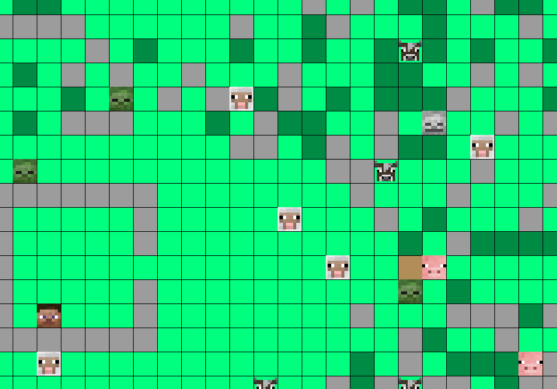

<h1 align="center"> Minecraft-2d </h1>

## Description
1. A simple game writen in Qt.
2. **[Download the compiled executable here](https://github.com/songquanpeng/minecraft-2d/releases/download/v1.0/MineCraft-2D.zip)**

## How to play?
|Key|Action|
|---|---|
|W,A,S,D|Move|
|TAB|Change to previous tool|
|CAPS LOCK|Change to next tool|
|ESC	|Back to the title|
|RIGHT BUTTON	|Use tool, eat food or navigate (depend what you hold)|
|LEFT BUTTON	|Use tool|
|ARROW KEY UP, DOWN, LEFT, RIGHT|Move the map| 

## Screenshot

## Demo

## Notice
Best screen resolution: 1920*1080